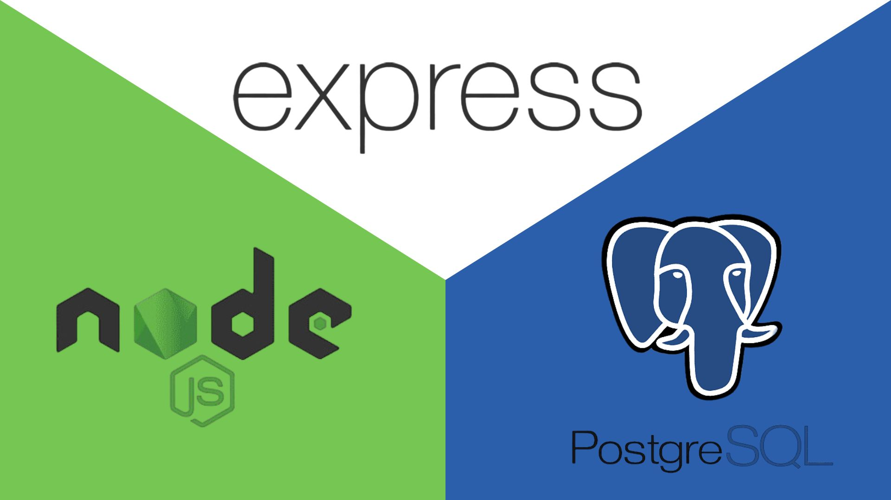

<p align="center">

</p>

# Proyecto - 01 Cafe - Api

## Descripcion del Proyecto

Este proyecto es una api de cafeteria, que permitira crear un producto o comida, con su imagen, con sus cantidades, su precio, su descripcion, añadir los ingredientes con los cuales se hizo ese producto, si es nuevo.
La aplicacion esta construida utilizandoo node.js express.js y utuliza como base de datos PostgresSQL para almacenar la informacion

[Aqui se encuentra la documentacion de la Api, has click aqui para usarla en tus proyectos](https://documenter.getpostman.com/view/28473907/2s9YR9YsTt)

## Caracteres principales

1. Crear producto

2. Subir emogis como imagenes del producto

3. Ver cada producto creado si es nuevo o no

4. Actualizar un producto

5. Eliminar un producto

# Tecnologias Utilizadas

1. express: un framework minimalista de node.js que facilita la creacion de aplicaciones web y APIs.

2. postgreSQL: es un sistema de gestión de bases de datos relacional orientado a objetos y de código abierto.

3. sequelize: Un ORM (Object Relational Mapper) para bases de datos SQL. que simplifica el trabajo con bases de datos SQL escribiendo código JavaScript en lugar de SQL.

4. Morgan: es una herramienta muy útil para registrar y monitorear solicitudes HTTP en aplicaciones de esta magnitud como Node.js y Express. Proporciona información valiosa para el desarrollo y la depuración, lo que permite comprender mejor el flujo de tus solicitudes y respuestas

## Requisitos previos para la utilizacion del proyecto

1. tener instalado node.js

2. tener instalado postgresSQL

3. tener creada una base de datos en postgresSQL

## Como ejecutar el proyecto en desarrollo

1. clonar el repositorio

2. ejecutar el siguiente comando para instalar las dependencias:

```

  npm install

```

3. crear una base de datos local en postgreSQL

4. clonar el .env.template y renombrarlo a .env y llenar las variables de entorno

5. levantar el modo desarrollo con el siguiente comando:

```

  npm run start:dev

```
